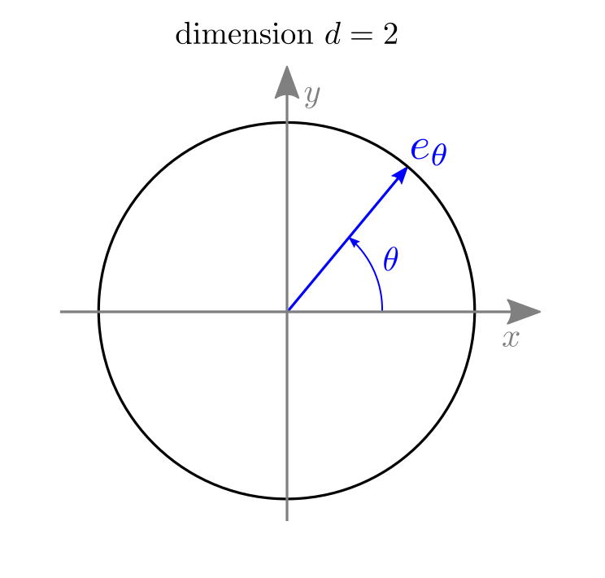
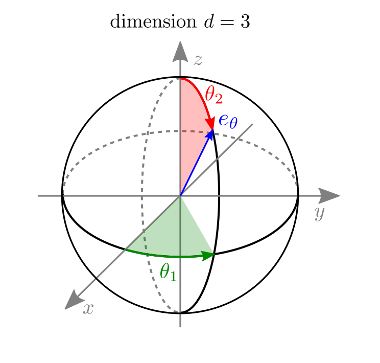

.. _mathematical_definitions:

Mathematical definitions
========================

Notations and basic modeling
----------------------------

Notations
~~~~~~~~~

First, let us define main quantities of interest involved in EPR
imaging in the continuous setting (we shall use the superscript
':math:`c`' to designate continuous signals and differentiate them
from their discrete counterparts). For the sake of simplicity, we
consider that the sample to be imaged is made of a single paramagnetic
species X (more specific notations will be introduced when dealing
with multiple EPR sources). Let

* :math:`h_X^c : \mathbb{R} \to \mathbb{R}` be the **reference
  spectrum** (also known as **zero-gradient spectrum**) of the
  paramagnetic species X;
  
* :math:`U_X^c : \mathbb{R}^d \to \mathbb{R}` be the **concentration
  mapping** of the paramagnetic species X (where :math:`d \in \{2,3\}`
  denotes the dimension of the spatial domain).

Now, let us consider that a **field gradient** :math:`\gamma \in
\mathbb{R}^d` is applied inside the EPR resonator. Let :math:`\mu =
\|\gamma\| \in \mathbb{R}_+` be the magnitude of the field gradient,
and let us denote by :math:`e_\theta \in \mathbb{R}^d` the unit vector
of the sphere such that

 .. math ::
    \gamma = \mu \cdot e_\theta \,.

The parameter :math:`\theta\in\mathbb{R}^{d-1}` is an angular
parameter that characterizes the orientation :math:`e_\theta` of the
field gradient :math:`\gamma`. In practice, when :math:`d=2`, the
parameter :math:`\theta \in \mathbb{R}` corresponds to the angle of
the polar coordinate system, and when :math:`d=3`, the parameter
:math:`\theta = (\theta_1, \theta_2) \in \mathbb{R}^2` is made of the
longitudinal (:math:`\theta_1`) and latitudinal (:math:`\theta_2`)
angles of the spherical coordinate system.

.. _polar_and_spherical-systems:

	
Notice that, in this modeling, the continuous signals :math:`h_X^c`
and :math:`U_X^c` were extended by zero outside from their actual
supports (leading to a signal :math:`h_X^c` defined over
:math:`\mathbb{R}` and a signal :math:`U_X^c` defined over
:math:`\mathbb{R}^d`) in order to facilitate their continuous
description using standard operators (convolution, Fourier transform,
Radon transform, etc.). The domains of those signals will be
restricted back to a finite domain when we will define their
:ref:`discrete counterparts <definitions_sec_discretization>`.

Radon transform
~~~~~~~~~~~~~~~

In the following, we will denote by :math:`\mathcal{R}_\theta(U_X^c)
: \mathbb{R}\to \mathbb{R}` the **Radon transform** of :math:`U_X^c`
in the direction :math:`e_\theta`, which is defined by

 .. math ::
   :label: radon-transform-continuous
   	   
   \forall r \in \mathbb{R}\,,\quad \mathcal{R}_\theta(U_X^c)(r) =
   \int_{\mathrm{Span(e_\theta)^\perp}} U_X^c(r e_\theta + s) \,
   \mathrm{d}s = \int_{\mathbb{R}^d} U_X^c(x) \, \delta_*(\langle x,
   e_\theta \rangle - r) \, \mathrm{d}x\,,

where :math:`\langle \cdot, \cdot \rangle` denotes the canonical inner
product in :math:`\mathbb{R}^d` and :math:`\delta_*(\cdot)` denotes
the Dirac mass. The Radon transform is at the core of the modeling of
EPR imaging, as we shall see below.

Projections and sinograms
~~~~~~~~~~~~~~~~~~~~~~~~~

An **EPR projection** corresponds to the mono-dimensional signal
:math:`\mathcal{P}_{X,\gamma}^c : \mathbb{R} \to \mathbb{R}`, acquired
when ramping up the intensity :math:`B \in \mathbb{R}` of the
homogeneous magnetic field applied to the paramagnetic sample (in
presence of a field gradient :math:`\gamma`). An EPR projection can be
linked to the reference spectrum :math:`h_X^c` of the EPR species
contained in the sample and its concentration mapping :math:`U_X^c`
through the relation

 .. math ::
   :label: continuous-projection
   
   \forall B \in \mathbb{R}\,,\quad \mathcal{P}_{X,\gamma}^{c}(B) =
   \big(h_X^c * \mathcal{R}_\theta^{\mu}(U_X^c)\big)(B) :=
   \int_{\mathbb{R}} h_X^c(B') \cdot \mathcal{R}_\theta^\mu(U_X^c)(B-B')
   \, \mathrm{d}B'\,,

where :math:`*` denotes the convolution operator and
:math:`\mathcal{R}_\theta^\mu(U_X^c)` denotes the dilatation of the
Radon transform of :math:`U_X^c` by the factor :math:`-\mu` (recall
that :math:`\mu = \|\gamma\|` represents the magnitude of the field
gradient :math:`\gamma`), which is defined by

 .. math ::
   :label: spin-profile-continuous

   \forall B \in \mathbb{R}\,,\quad \mathcal{R}_\theta^\mu(U_X^c)(B)
   = \frac{1}{\mu} \cdot \mathcal{R}_\theta(U_X^c)(-B/\mu)\,.

An **EPR sinogram** simply corresponds to the aggregation of multiple
projections, acquired for different values of field gradient
:math:`\gamma` (i.e., different values of orientation :math:`e_\theta`
or/and magnitude :math:`\mu`). Given a sequence
:math:`\Gamma = (\gamma_1, \gamma_2, \dots, \gamma_N) \in
(\mathbb{R}^d)^N` made of :math:`N` magnetic field gradient vectors, a
sinogram :math:`\mathcal{S}_{\Gamma}^c` can be defined as

 .. math ::
   :label: sinogram-continuous

   \forall B \in \mathbb{R} \,,\quad
   \mathcal{S}_{X,\Gamma}^c(B) = \big(
   \mathcal{P}_{X,\gamma_1}^c(B), \mathcal{P}_{X,\gamma_2}^c(B),
   \dots, \mathcal{P}_{X,\gamma_N}^c(B) \big)\,.

In most commercial EPR-imagers, a sinogram corresponds to the
acquisition of multiple projections with a fixed field gradient
intensity :math:`\mu` and multiple field gradient orientations
:math:`e_\theta`. However, we will not limit to this particular
situation and consider that a sinogram can gather projections acquired
with different field gradient :math:`\gamma`, without any
supplementary assumption.

.. _definitions_sec_discretization:

Discretization
~~~~~~~~~~~~~~

In practice, the acquired spectra, projections and the images that we
reconstruct are discrete signals with finite number of samples. We
shall explain now how those signals can be linked to their continuous
counterparts. In the next sections, we will focus on the definitions
of the discrete projection / backprojection operators implemented in
the PyEPRI package.

First, let us introduce a generic (and useful) notation to refer to
the domain of the discrete signals. For any integer :math:`K>0`
(representing a number of sample), we denote by :math:`I_K` the set of
:math:`K` consecutive integers *centered at 0*, defined by

 .. math ::
   :label: generic-discrete-domain
   
   I_K = \left[-\frac{K}{2}, \frac{K}{2}\right) \cap \mathbb{Z} =
   -\left\lfloor \frac{K}{2} \right\rfloor + \bigg\{0, 1, \dots,
   K-1\bigg\},

where :math:`\lfloor \cdot \rfloor` denotes the lower integer part
operator.
	   

In practice, EPR spectra and projections are not acquired for all
:math:`B \in \mathbb{R}` but over a bounded acquisition range of
homogeneous magnetic field intensity,

 .. math ::
   :label: range-B

   B \in B_{cf} + \left[- \frac{B_{sw}}{2} \,,\, \frac{B_{sw}}{2}
   \right],

where :math:`B_{cf} \in \mathbb{R}` and :math:`B_{sw} \in
\mathbb{R}_+` are called the *center-field* and the *sweep-width* and
respectively represent the center and the length of this acquisition
range. During an EPR experiment, we consider that all acquired
projections share the same acquisition range defined by
:eq:`range-B`. Real-life acquisitions are made for a finite number of
samples of homogeneous magnetic field intensities in the acquisition
range. We will assume those samples to be **regularly spaced**. Let us
denote by :math:`N_B` the number of samples, the homogeneous magnetic
field intensity nodes are the :math:`\{B_m\}_{m \in I_{N_B}}` defined
by

 .. math ::
   :label: B-nodes
   
   \forall m \in I_{N_B}, \quad B_m = B_{cf} + m \cdot \delta_B\,.

where :math:`\delta_B = \tfrac{B_{sw}}{N_B}` represents the **sampling
step of the homogeneous magnetic field intensity**.

Accurate sampling always come after an appropriate filtering and we
will place ourselves in this setting (see more details in
:cite:p:`Abergel_2023`). For that purpose, we introduce below the
filtered reference spectrum :math:`\widetilde{h_X^c}: \mathbb{R} \to
\mathbb{R}` and projection
:math:`\widetilde{\mathcal{P}_{X,\gamma}^c}` defined by

 .. math ::
   :label: filtered-reference-spectrum-and-projection

   \widetilde{h_X^c} = g_{\delta_B} * h_X^c \quad \text{and} \quad
   \widetilde{\mathcal{P}_{X,\gamma}^c} = g_{\delta_B} *
   \mathcal{P}_{X,\gamma}^c\,,

where :math:`g_{\delta_B}` is the cut-band filter defined through its
Fourier transform

 .. math ::
   :label: cutband-filter

   \forall \xi \in \mathbb{R}\,,\quad \mathcal{F}(g_{\delta_B}) =
   \int_{\mathbb{R}} g_{\delta_B}(B) \, e^{-i B\xi} \, \mathrm{d}B =
   \left\{\begin{array}{cl}1 & \text{if } |\xi| \leq
   \frac{\pi}{\delta_B}\\ 0 & \text{otherwise.}\end{array}\right.
      
A direct consequence from
:eq:`filtered-reference-spectrum-and-projection` is that the Fourier
transform of the filtered signal :math:`\widetilde{h_X^c}`
(respectively :math:`\widetilde{\mathcal{P}_{X,\gamma}^c}`) coincides
with that of :math:`h_X^c` (respectively
:math:`{\mathcal{P}_{X,\gamma}^c}`) over the frequency domain
:math:`\left[-\frac{\pi}{\delta_B}, \frac{\pi}{\delta_B}\right]` and
is zero outside from this domain. In practice, the fast decrease of
the Fourier transforms of :math:`h_X^c` and
:math:`\mathcal{P}_{X,\gamma}^c` (both quickly fall below the noise
level) allows to consider that :math:`\widetilde{h_{X}^c} \approx
h_{X}^c` and :math:`\widetilde{\mathcal{P}_{X,\gamma}^c} \approx
\mathcal{P}_{X,\gamma}^c` and as long as the sampling step
:math:`\delta_B` is *small enough*.

Now we are ready to define the discrete counterparts of the continuous
signals :math:`h_X^c` and :math:`\mathcal{P}_{X,\gamma}^c` (projection
acquired in presence of a field gradient :math:`\gamma`). We will
denote those counterparts by :math:`h_X^\mathrm{d} : I_{N_B} \mapsto
\mathbb{R}` and :math:`p_{X,\gamma} : I_{N_B} \mapsto
\mathbb{R}`. Those discrete and finite signals are defined by

 .. math ::
   :label: discrete-h-and-p

   \forall m \in I_{N_B}\,,\quad h_X(m) = \widetilde{h_X^c}(B_m) \quad
   \text{and} \quad p_{X,\gamma}(m) =
   \widetilde{\mathcal{P}_{X,\gamma}^c}(B_m)\,.

We shall introduce now the sampling of :math:`U_X^c` over a regular
grid. Let :math:`\delta > 0` be a spatial sampling step (this spatial
sampling step is common to all coordinate axes of the image and will
be in practice set by the user of image reconstruction
algorithms). Again, we need to introduce the filtering of the image
:math:`U_X^c` into :math:`\widetilde{U_X^c} = f_\delta * U_X^c` where
the cut-band filter :math:`f_\delta` is defined through its Fourier
transform by

 .. math ::
   :label: filtered-image

   \forall \xi \in \mathbb{R}^d\,,\quad \mathcal{F}(f_\delta)(\xi) =
   \int_{\mathbb{R}^d} f_\delta(x) \, e^{-i \langle x, \xi \rangle} \,
   \mathrm{d} x = \left\{\begin{array}{cl}1 &\text{if } \|\xi\| \leq
   \frac{\pi}{\delta}\\ 0 &\text{otherwise.}\end{array}\right.

Now, let :math:`(N_i)_{1 \leq i \leq d}` be the numbers of samples
along the :math:`d` coordinate axes of the sampled image, let
:math:`\Omega = I_{N_1} \times \dots \times I_{N_d}`, and let
:math:`u_X : \Omega \to \mathbb{R}` be the discrete image defined by

 .. math ::
   :label: discrete-u
   	   
   \forall k \in \Omega\,,\quad u_X(k) = \widetilde{U_X^c}(k
   \delta)\,.

Before going further, let us recall the definition of the discrete
Fourier transform of a (mono-dimensional) discrete signal. Given any
discrete signal :math:`v : I_{N_B} \to \mathbb{R}`, we call discrete
Fourier transform of :math:`v` the (:math:`N_B`-periodical) discrete
and complex signal :math:`\mathrm{DFT}(v) : \mathbb{Z} \to \mathbb{C}`
defined by

 .. math ::
   :label: dft

   \forall \alpha \in \mathbb{Z}\,,\quad \mathrm{DFT}(v)(\alpha) =
   \sum_{m \in I_{N_B}} v(m) \, e^{-2 i \pi m \alpha/N_B}\,.

The :math:`\mathrm{DFT}` operator is invertible and we shall denote by
:math:`\mathrm{IDFT}` its inverse. The :math:`\mathrm{DFT}` and
:math:`\mathrm{IDFT}` operators can be efficiently evaluated using the
Fast Fourier Transform (FFT) Algorithm, in particular, using the
`Fastest Fourier Transform in the West (FFTW) library
<https://fftw.org/>`_.

The notion of discrete Fourier transform can be extended to define the
nonuniform discrete Fourier transform of a (:math:`d`-dimensional)
discrete signal. Given any discrete signal :math:`v : \Omega \to
\mathbb{R}`, we call nonuniform discrete Fourier transform of
:math:`v` the complex signal :math:`\mathrm{NDFT}(v) : \mathbb{R}^d
\to \mathbb{C}` defined by

 .. math ::
   :label: ndft
    	    
   \forall \omega \in\mathbb{R}^d\,,\quad \mathrm{NDFT}(v)(\omega) =
   \sum_{k \in \Omega} v(k) \, e^{-i \langle k , \omega \rangle}.

The PyEPRI package relies on the `Flatiron Institute Nonuniform Fast
Fourier Transform (FINUFFT) library
<https://finufft.readthedocs.io/en/latest/>`_ for the fast and
accurate evaluation of the :math:`\mathrm{NDFT}` operator over any
sequence :math:`\omega = (\omega_1, \omega_2, \dots, \omega_M) \in
(\mathbb{R}^d)^M` made of :math:`M` nonuniform frequency nodes (see
:cite:p:`Barnett_2019,Barnett_2021,Shih_2021`).

Last, for any field gradient vector :math:`\gamma\in\mathbb{R}^d`, let us define the set 

 .. math ::
   :label: discrete-frequency-support
   	   
   C_{\delta, \delta_B}^{N_B}(\gamma) = \left\{\alpha \in \mathbb{Z}\,,\quad
   \|\alpha \, \gamma \| < \frac{N_B \delta_B}{2 \delta} \text{ and }
   | \alpha | < \frac{N_B}{2}\right\}\,.

Under several assumptions (see more details in :cite:p:`Abergel_2023`)
we can derive the following approximation between the discrete Fourier
coefficients of the discrete projection :math:`p_\gamma`, those of the
discrete reference spectrum :math:`h_X`, and some nonuniform discrete
Fourier coefficients of the discrete image :math:`u_X`, that is, for
all :math:`\alpha \in I_{N_B}`,
      
 .. math ::
   :label: link-u-and-p

   %   
   \mathrm{DFT}(p_{X,\gamma})(\alpha)
   \approx \mathrm{DFT}(h_X)(\alpha) \cdot \left\{   
   %
   \begin{array}{cl}
   %
   \delta^d \cdot \mathrm{NDFT}(u_X)\left(-\frac{2 \pi \alpha \delta}{N_B \delta_B}
   \, \gamma\right) & \text{if } \alpha \in \mathcal{C}_{\delta,
   \delta_B}^{N_B}(\gamma) \\
   %
   0 & \text{otherwise.}
   %
   \end{array}
   \right.

We are now ready to formally define the projection operator
implemented in the PyEPRI package.

Single source operators
-----------------------

Projection operator
~~~~~~~~~~~~~~~~~~~

Neglecting the modeling and approximation errors involved in
:eq:`link-u-and-p`, we get

 .. math ::
   :label: Agamma

   p_{X,\gamma} = A_{X,\gamma}(u_X)

where :math:`A_{X,\gamma} u_X` is defined through its discrete Fourier
coefficients by setting, for all :math:`\alpha\in I_{N_B}`, 

 .. math ::
   :label: dftAgamma

   \mathrm{DFT}(A_{X,\gamma}(u_X))(\alpha) =
   \mathrm{DFT}(h_X)(\alpha) \!\cdot\! \left\{
   %
   \begin{array}{cl}
   %   
   \delta^d \!\cdot\! \mathrm{NDFT}(u_X)\left(-\frac{2 \pi \alpha
   \delta}{N_B \delta_B} \, \gamma\right) & \text{if } \alpha \in
   \mathcal{C}_{\delta, \delta_B}^{N_B}(\gamma) \\   
   %
   0 & \text{otherwise.}
   %
   \end{array}
   \right.

Equation :eq:`Agamma` (through Equation :eq:`dftAgamma`) defines a
linear operator :math:`A_{X,\gamma} : \mathbb{R}^\Omega \to
\mathbb{R}^{I_{N_B}}` that can synthesize a discrete projection
:math:`p_{X,\gamma}` from a discrete image :math:`u_X`.

**Note**: in the above description, we made explicit the
parametrization of the :math:`A_{X,\gamma}` operator by the magnetic
field gradient :math:`\gamma` but the operator is also implicitly
parameterized by the discrete reference spectrum :math:`h_X` and the
sampling steps :math:`\delta_B` and :math:`\delta` since these
parameters are involved in the formal definition of
:math:`A_{X,\gamma}`.

Given a sequence made of `N` magnetic field gradient vectors
:math:`\Gamma = (\gamma_1, \gamma_2, \dots, \gamma_N) \in
(\mathbb{R}^d)^N`, we can stack the projections generated using each
:math:`A_{X,\gamma_n}` operator (for :math:`1 \leq n \leq N`), in
order to generate a sinogram, leading to

 .. math ::
   :label: Agammabold

   s_{X,\Gamma} := A_{X,\Gamma} (u_X) := \big(A_{X,\gamma_1}(u_X),
   A_{X,\gamma_2}(u_X), \dots, A_{X,\gamma_N}(u_X)\big)\,.

Equation :eq:`Agammabold` defines another (and more general) linear
operator that can synthesize a discrete sinogram
:math:`s_{X,\Gamma}` from a discrete image :math:`u_X`.

**PyEPRI implementation** : the :math:`A_{X,\Gamma}`
operator is implemented in the :py:mod:`pyepri.monosrc` submodule of
the PyEPRI package, more precisely in the
:py:func:`pyepri.monosrc.proj2d` function (suited to 2D input images)
and the :py:func:`pyepri.monosrc.proj3d` function (suited to 3D input
images). Detailed and reproducible examples of use for the
:py:func:`pyepri.monosrc.proj2d` and :py:func:`pyepri.monosrc.proj3d`
functions are provided in the first two sections of :ref:`this
tutorial <tutorial_projection>`.

Backprojection operator
~~~~~~~~~~~~~~~~~~~~~~~

We call **backprojection operator** the adjoint
:math:`A_{\Gamma}^*` of the projection operator
:math:`A_{\Gamma}`. For any sequence of magnetic field
gradient vectors :math:`\Gamma = (\gamma_1, \gamma_2,
\dots, \gamma_N) \in (\mathbb{R}^d)^N` and any discrete sinogram
:math:`s = (p_1, p_2, \dots, p_N) \in
\left(\mathbb{R}^{I_{N_B}}\right)^N` gathering :math:`N` projections,
it satisfies,

 .. math ::
   :label: backproj
   
   A_{X,\Gamma}^* (s) = \sum_{n = 1}^{N} A_{X,\gamma_n}^*
   (p_n)\,,

and, from :eq:`dftAgamma`, one can easily check that, for any :math:`n
\in \{1, 2, \dots, N\}`, the adjoint of :math:`A_{X,\gamma_n}` (also
called backprojection operator) satisfies

 .. math ::
   :label: backproj-dft
	   
   \forall k \in \Omega\,,\quad A_{X,\gamma_n}^* (p_n)(k) =
   \frac{\delta^d}{N_B} \sum_{\alpha \in
   \mathcal{C}_{\delta,\delta_B}^{N_B}(\gamma_n)}
   \overline{\mathrm{DFT}(h_X)(\alpha)} \, \mathrm{DFT}(p_n)(\alpha)
   \, e^{- \frac{2 i \pi \alpha \delta}{N_B \delta_B} \, \langle
   \gamma_n ,\, k\rangle }\,,

where :math:`\overline{z}` denotes the complex conjugate of :math:`z
\in \mathbb{C}`. The sum over :math:`\alpha` involved in
:eq:`backproj-dft` corresponds to the adjoint of the
:math:`\mathrm{NDFT}` transform of an image over the nonuniform
frequency nodes

 .. math ::

  \omega \in \left\{- \frac{2 \pi \alpha \delta}{N_B \delta_B}
  \gamma_n\,,~~ \alpha \in \mathcal{C}_{\delta,
  \delta_B}^{N_B}(\gamma_n) \right\}

applied to the restriction to :math:`\mathcal{C}_{\delta,
\delta_B}^{N_B}(\gamma_n)` of the signal
:math:`\overline{\mathrm{DFT}(h_X)} \cdot \mathrm{DFT}(p_n)`. It can
be efficiently and accurately evaluated using the `FINUFFT package
<https://finufft.readthedocs.io/en/latest/>`_.

**PyEPRI implementation**: the backprojection operator
:math:`A_{X,\Gamma}^*` is implemented in the
:py:mod:`pyepri.monosrc` submodule of the PyEPRI package, more
precisely in the functions :py:func:`pyepri.monosrc.backproj2d` (2D
setting) and :py:func:`pyepri.monosrc.backproj3d` (3D setting). We
refer to the two first sections of the :ref:`dedicated tutorial
<tutorial_backprojection>` for a detailed demonstration of theses
functions.

Fast evaluation of a projection-backprojection operation
~~~~~~~~~~~~~~~~~~~~~~~~~~~~~~~~~~~~~~~~~~~~~~~~~~~~~~~~

In this section, we focus on the *projection-backprojection*
operation, that is, the evaluation of the discrete image :math:`v_X :=
A_{X,\Gamma}^* \circ A_{X,\Gamma} (u_X)` from the discrete image
:math:`u_X` and for a given sequence of magnetic field gradient
vectors :math:`\Gamma = (\gamma_1, \gamma_2, \dots, \gamma_N) \in
(\mathbb{R}^d)^N`. Using :eq:`Agammabold` and :eq:`backproj`, one
easily gets

 .. math ::
   :label: proj-backproj
      
    A_{X,\Gamma}^* \circ A_{X,\Gamma} (u_X) = \sum_{n = 1}^{N}
    A_{X,\gamma_n}^* \circ A_{X,\gamma_n} (u_X)\,.

In the following, we shall denote be :math:`\Upsilon` the augmented
image domain :math:`\Upsilon := I_{2 N_1} \times \dots \times I_{2
N_d}` (recall that the image domain is :math:`\Omega = I_{N_1} \times
\dots \times I_{N_d}`). Besides, injecting :eq:`dftAgamma` into
:eq:`backproj-dft`, one easily gets,

 .. math ::
   :label: proj-backproj-n
   
   \forall k \in \Omega\,,\quad A_{X,\gamma_n}^* \circ A_{X,\gamma_n}
   (u_X)(k) = \sum_{k' \in \Omega} u_X(k') \, \varphi_{\gamma_n}(k-k')

where

 .. math ::
   :label: phi_n
   
   \forall k^{\prime\prime} \in \Upsilon\,,\quad
   \varphi_{\gamma_n}(k^{\prime\prime}) = \frac{\delta^{2d}}{N_B}
   \sum_{\alpha \in \mathcal{C}_{\delta, \delta_B}^{N_B}(\gamma_n)}
   \overline{\mathrm{DFT}(h_X)(\alpha)} \, \mathrm{DFT}(h_X)(\alpha)
   \, e^{-\frac{2 i \pi \alpha \delta}{N_B \delta_B} \langle
   k^{\prime\prime} , \, \gamma_n \rangle}\,.

Finally, using :eq:`proj-backproj-n` into :eq:`proj-backproj`, we get

 .. math ::
   :label: proj-backproj-2
      
    \forall k \in \Omega\,,\quad A_{X,\Gamma}^* \circ A_{X,\Gamma}
    (u_X) = \sum_{k' \in \Omega} u_X(k') \, \varphi(k-k') \quad
    \text{where}\quad \varphi := \sum_{n=1}^{N} \varphi_{\gamma_n}\,.

We can recognize in :eq:`proj-backproj-2` a **convolution** between
:math:`u_X` and :math:`\varphi` (notice that the two signals have
different domains, since the domain of :math:`u_X` is :math:`\Omega`
and is strictly included into :math:`\Upsilon`, the domain of
:math:`\varphi`). Also, this means that the
:math:`A_{X,\Gamma}^* \circ A_{X,\Gamma}` operator
exhibits a Toeplitz structure. For that reason, the convolution kernel
:math:`\varphi` will be referred from now as a **Toeplitz kernel**.
An efficient way to evaluate the convolution between :math:`u_X` and
the Toeplitz kernel :math:`\varphi` consists in

 1. extending by zero the signal :math:`u_X` from its initial domain
    :math:`\Omega` towards the augmented domain :math:`\Upsilon`,
    
 2. computing the *circular convolution* (that is, the convolution
    with periodical boundary condition) between this augmented image
    and the kernel :math:`\varphi`, 
    
 3. and then cropping the resulting signal to the initial image domain
    :math:`\Omega`.

The circular convolution mentioned in step 2. of this process can be
efficiently evaluated using Fast Fourier Transforms of the involved
signals. This numerical trick is well known and usually more efficient
(in terms of computation time) than a direct evaluation of the sum
:eq:`proj-backproj-2` thanks to the linear logarithmic complexity of
the FFT Algorihtm. However, this process is also memory consuming due
to the use of two signals with extended domain :math:`\Upsilon`, so
that this trick may not be suited to images with **too large**
dimensions :math:`(N_1, \dots, N_d)`.

It is important to note that the evaluation of
:math:`A_{X,\Gamma}^* \circ A_{X,\Gamma}
(u_X)` using the procedure described above is usually **much more
faster** than the successive evaluation of the
:math:`A_{X,\Gamma}` and
:math:`A_{X,\Gamma}^*` operators taken separately (that
is the evaluation of :math:`s_{X,\Gamma} =
A_{X,\Gamma} (u_X)` followed by the evaluation of
:math:`v_X = A_{X,\Gamma}^*
(s_{X,\Gamma})`). The ability to rapidly perform the
projection-backprojection operation is of crucial importance in the
implementation of iterative algorithms dedicated to EPR imaging.

**PyEPRI implementation**: the PyEPRI package provides functions to
compute the Toeplitz kernel :math:`\varphi` and performing the fast
evaluation of the projection-backprojection :eq:`proj-backproj`. The
Toeplitz kernel :math:`\varphi` can be computed using the function
:py:func:`pyepri.monosrc.compute_2d_toeplitz_kernel` in the 2D setting
and using the function
:py:func:`pyepri.monosrc.compute_3d_toeplitz_kernel` in the 3D
setting. Once the Toeplitz kernel is computed, the functions
:py:func:`pyepri.monosrc.apply_2d_toeplitz_kernel` and
:py:func:`pyepri.monosrc.apply_3d_toeplitz_kernel` can be used to
evaluate efficiently the projection-backprojection
:math:`A_{X,\Gamma}^* \circ A_{X,\Gamma} (u_X)` in the 2D and 3D
settings. Detailed examples of computation and use of Toeplitz kernels
are available in the two first sections of :ref:`this tutorial
<tutorial_toeplitz>`.

Multisources operators
----------------------

Modeling
~~~~~~~~

We will consider now a sample made of multiple EPR sources. We denote
by :math:`\mathcal{X} = (X_1, X_2, \dots, X_K)` the EPR sources
contained into the sample to be imaged. We will again describe the
projection process in the continuous domain before focusing on the
discrete setting and the associated operators. For any :math:`j \in
\{1,2,\dots, K\}`, let

+ :math:`h_{X_j}^c : \mathbb{R} \to \mathbb{R}` denote the reference
  spectrum of the :math:`j`-th EPR source :math:`X_j`;

+ :math:`U_{X_j}^c : \mathbb{R}^d \mapsto \mathbb{R}` denote the
  concentration mapping of the :math:`j`-th EPR source :math:`X_j`.

We shall also denote by :math:`U_{\mathcal{X}}^c := \big(U_{X_1}^c,
U_{X_2}^c, \dots, U_{X_K}^c \big)` the sequence gathering all
mono-source concentration mappings.

In presence of a magnetic field gradient :math:`\gamma = \mu \cdot
e_\theta \in \mathbb{R}^d`, the EPR projection acquired from the
mixture :math:`\mathcal{X}` of EPR sources is modeled as the signal
:math:`P_{\mathcal{X},\gamma}^c : \mathbb{R} \to \mathbb{R}` defined
by

 .. math ::

    \forall B\in\mathbb{R}\,,\quad P_{\mathcal{X},\gamma}^c(B) =
    \sum_{j = 1}^{K} \big(h_{X_j}^c *
    \mathcal{R}_{\theta}^{\mu}(U_{X_j}^{c})\big)(B)\,,

According to this (linear) modeling, we can see that the projection
:math:`P_{\mathcal{X},\gamma}^c` is simply obtained by summing the
contributions of all individual EPR sources.

Filtering and sampling the continuous signals as we did in the
single-source framework yields their discrete counterparts, that
are,

+ :math:`h_{X_j} : I_{N_B} \to \mathbb{R}`, the discrete reference
  spectrum associated to the :math:`j`-th EPR source :math:`X_j`, that
  corresponds to the sampling of reference spectrum :math:`h_{X_j}^c`
  (filtered by :math:`g_{\delta_B}`) with sampling step
  :math:`\delta_B`;

+ :math:`u_{X_j} : \Omega_j \to \mathbb{R}` the discrete concentration
  mapping of the :math:`j`-th EPR source :math:`X_j`, corresponding to
  the sampling of the image :math:`U_{X_j}^c` (filtered by
  :math:`f_\delta`) with step :math:`\delta` along each coordinate
  axis (where :math:`\Omega_j := I_{N_1^{(j)}} \times I_{N_2^{(j)}}
  \times \dots I_{N_d^{(j)}}` represents the discrete domain with
  dimensions :math:`(N_i^{(j)})_{1 \leq i \leq d}` of the :math:`j`-th
  EPR source image :math:`u_j`);

+ :math:`u_{\mathcal{X}} = \big(u_{X_1}, u_{X_2}, \dots,
  u_{X_K}\big)`, the sequence of discrete images gathering the
  discrete concentration mappings of all EPR sources present in the
  sample.

By summing the contributions of all different sources, we obtain the
discrete projection :math:`p_{\mathcal{X},\gamma} : I_{N_B} \to
\mathbb{R}` defined by

 .. math ::
   :label: multisrc-proj

    p_{\mathcal{X},\gamma} = \sum_{j = 1}^K A_{X_j,
    \gamma}(u_{X_j})\,,

and that corresponds (up to modeling and approximation errors involved
in the sampling process) to the sampling of
:math:`\mathcal{P}_{\mathcal{X},\gamma}^c` with sampling step
:math:`\delta_B` over the range :math:`B \in B_{cf} +
\left[-\frac{B_{sw}}{2}, \frac{B_{sw}}{2}\right]`.

When a sequence :math:`\Gamma = \big(\gamma_1,
\gamma_2,\dots, \gamma_N\big) \in \big(\mathbb{R}^d\big)^N` of
magnetic field gradient vectors is available, a discrete sinogram
:math:`s_{\mathcal{X}, \Gamma} =
(p_{\mathcal{X},\gamma_1}, p_{\mathcal{X},\gamma_2}, \dots,
p_{\mathcal{X},\gamma_N}) \in (\mathbb{R}^{I_{N_B}})^N` can be
obtained using

 .. math ::
   :label: multisrc-sino

    s_{\mathcal{X},\Gamma} = \left( A_{\mathcal{X}, \gamma_1}
    (u_{\mathcal{X}}) , A_{\mathcal{X}, \gamma_2} (u_{\mathcal{X}}),
    \dots, A_{\mathcal{X}, \gamma_N} (u_{\mathcal{X}})\right)\,,

which simply stacks together the projections
:math:`\left(A_{\mathcal{X}, \gamma_1}(u_{\mathcal{X}})\right)_{1 \leq
n \leq N}`.

Projection operator
~~~~~~~~~~~~~~~~~~~

Equation :eq:`multisrc-proj` provides an explicit way to synthesize a
projection from a sequence of multiple EPR sources. Formally, let us
define the multisources projection operator
:math:`A_{\mathcal{X},\gamma} : \mathbb{R}^{\Omega_1} \times
\mathbb{R}^{\Omega_2} \times \dots \times \mathbb{R}^{\Omega_K} \to
\mathbb{R}^{I_{N_B}}` by

 .. math ::
   :label: multisrc-proj-def

   \forall u = \big(u_1, u_2, \dots, u_K\big) \in
   \mathbb{R}^{\Omega_1} \times \mathbb{R}^{\Omega_2} \times \dots
   \times \mathbb{R}^{\Omega_K}\,,\quad A_{\mathcal{X},\gamma}(u) =
   \sum_{j = 1}^K A_{X_j, \gamma}(u_j)\,.

Considering now a sequence :math:`\Gamma = (\gamma_1, \gamma_2, \dots,
\gamma_{N}) \in \big(\mathbb{R}^d\big)^N` of field gradient vectors,
the projection operator :math:`A_{\mathcal{X},\gamma}` can be
generalized into :math:`A_{\mathcal{X},\Gamma} : \mathbb{R}^{\Omega_1}
\times \mathbb{R}^{\Omega_2} \times \dots \times \mathbb{R}^{\Omega_K}
\mapsto (\mathbb{R}^{I_{N_B}})^N` using, for any :math:`u = \big(u_1,
u_2, \dots, u_K\big) \in \mathbb{R}^{\Omega_1} \times
\mathbb{R}^{\Omega_2} \times \dots \times \mathbb{R}^{\Omega_K}`,

 .. math ::
   :label: multisrc-sino-def
   
   A_{\mathcal{X},\Gamma}(u) =
   \left(A_{\mathcal{X},\gamma_1}(u) , A_{\mathcal{X},\gamma_2}(u) ,
   \dots, A_{\mathcal{X},\gamma_N}(u) \right)\,.

The operator :math:`A_{\mathcal{X},\Gamma}` can be used
to generate a discrete sinogram from a sequence of multiple EPR source
images.

**PyEPRI implementation** : the
:math:`A_{\mathcal{X},\Gamma}` operator is implemented
into the :py:mod:`pyepri.multisrc` submodule of the PyEPRI package,
more precisely in the :py:func:`pyepri.multisrc.proj2d` function
(suited to sequences of 2D input images) and the
:py:func:`pyepri.multisrc.proj3d` function (suited to sequences of 3D
input images). Detailed and reproducible examples of use for the
:py:func:`pyepri.multisrc.proj2d` and
:py:func:`pyepri.multisrc.proj3d` functions are provided in the last
two sections of :ref:`this tutorial <tutorial_projection>`.

Backprojection operator
~~~~~~~~~~~~~~~~~~~~~~~

In the multisources setting, we call backprojection operator the
adjoint :math:`A_{\mathcal{X},\Gamma}^*` of the
projection operator :math:`A_{\mathcal{X},\Gamma}`. We
can show that, for any :math:`s = (p_1, p_2, \dots, p_N) \in
(\mathbb{R}^{I_{N_B}})^N`, we have

 .. math ::
   :label: multisrc-backproj

   A_{\mathcal{X}, \Gamma}^* (s) = \sum_{n=1}^{N}
   A_{\mathcal{X}, \gamma_n}^* (p_n)\,,

where

 .. math ::
   :label: multisrc-backproj-2
   
   A_{\mathcal{X}, \gamma_n}^* (p_n) = \left( A_{X_1, \gamma_n}^*
   (p_n), A_{X_2, \gamma_n}^* (p_n), \dots, A_{X_K, \gamma_n}^* (p_n)
   \right) = \left( A_{X_m, \gamma_n}^* (p_n) \right)_{1 \leq m \leq K}\,,

is simply obtained by stacking the mono-source backprojection
operators :math:`A_{X_j,\gamma_n}^*` defined in Fourier domain in
:eq:`backproj-dft`.

**PyEPRI implementation**: the multisources backprojection operator
:math:`A_{\mathcal{X},\Gamma}^*` is implemented in the
:py:mod:`pyepri.multisrc` submodule of the PyEPRI package, more
precisely in the functions :py:func:`pyepri.multisrc.backproj2d` (2D
setting) and :py:func:`pyepri.multisrc.backproj3d` (3D setting). We
refer to the two last sections of the :ref:`dedicated tutorial
<tutorial_backprojection>` for a detailed demonstration of theses
functions.

Fast evaluation of a projection-backprojection operation
~~~~~~~~~~~~~~~~~~~~~~~~~~~~~~~~~~~~~~~~~~~~~~~~~~~~~~~~

Let us focus on the *projection-backprojection* operation in the
multisources setting. Let :math:`u = (u_1, u_2, \dots, u_K) \in
\mathbb{R}^{\Omega_1} \times \mathbb{R}^{\Omega_2} \times \dots \times
\mathbb{R}^{\Omega_K}`, let :math:`\Gamma = (\gamma_1, \gamma_2,
\dots, \gamma_N) \in (\mathbb{R}^d)^N`. Thanks to
:eq:`multisrc-sino-def` and :eq:`multisrc-backproj`, we have

 .. math ::
   :label: proj-backproj-multisrc

   A_{\mathcal{X},\Gamma}^* \circ A_{\mathcal{X},\Gamma}(u) = \sum_{n
   = 1}^N A_{\mathcal{X},\gamma_n}^* \circ
   A_{\mathcal{X},\gamma_n}(u)\,.

Besides, from :eq:`multisrc-proj-def`, :eq:`multisrc-sino-def` and
:eq:`multisrc-backproj-2`, for any :math:`n \in \{1, 2, \dots, N\}`,
we have

 .. math ::
   :label: proj-backproj-multisrc-nm

   A_{\mathcal{X},\gamma_n}^* \circ A_{\mathcal{X},\gamma_n}(u) =
   \left( \sum_{j = 1}^K A_{X_m, \gamma_n}^* \circ A_{X_j,
   \gamma_n}(u_j)\right)_{1 \leq m \leq K}\,.

Then, using :eq:`dftAgamma` and :eq:`backproj-dft`, one gets,

 .. math ::
   :label: proj-backproj-multisrc-nm-2
      
   \forall k\in\Omega\,,\quad \left(A_{X_m, \gamma_n}^* \circ A_{X_j,
   \gamma_n}(u_j)\right)(k) = \sum_{k'\in\Omega} u_j(k') \,
   \psi_{m,j,\gamma_n}(k-k')\,,

where, for all :math:`k^{\prime\prime} \in \Upsilon`, we have set

 .. math ::
   :label: psi_mjn
   
   \psi_{m,j,\gamma_n}(k^{\prime\prime}) = \frac{\delta^{2d}}{N_B}
   \sum_{\alpha \in C_{\delta,\delta_B}^{N_B}(\gamma_n)}
   \overline{\mathrm{DFT}(h_{X_m})(\alpha)} \,
   \mathrm{DFT}(h_{X_j})(\alpha) \, e^{-\frac{2 i \pi \alpha
   \delta}{N_B \delta_B} \langle k^{\prime\prime} , \gamma_n
   \rangle}\,.

Using :eq:`proj-backproj-multisrc-nm-2` into
:eq:`proj-backproj-multisrc-nm` and then into
:eq:`proj-backproj-multisrc`, we end up with

 .. math ::
   :label: AstarA-multisrc
        
    \forall k\in\Omega\,,\quad A_{\mathcal{X},\Gamma}^* \circ
    A_{\mathcal{X},\Gamma}(u)(k) = \left( \sum_{j = 1}^{K}
    \sum_{k'\in\Omega} u_j(k') \, \psi_{m,j}(k-k') \right)_{1 \leq m
    \leq K}

where :math:`\psi_{m,j}` is defined by 

 .. math ::
   :label: psi_mj
 
   \psi_{m,j} = \sum_{n=1}^{N} \psi_{m,j,\gamma_n}

and will be referred as the Toeplitz kernel of the cross sources
:math:`(m,j)`. The cross sources Toeplitz kernels
:math:`\left(\psi_{m,j}\right)_{1 \leq (m,j) \leq K}` can be
efficiently evaluated using the `FINUFFT package
<https://finufft.readthedocs.io/en/latest/>`_.

Each term :math:`\sum_{k'\in\Omega} u_j(k') \, \psi_{m,j}(k-k')` in
:eq:`AstarA-multisrc` corresponds to the convolution between the
:math:`j`-th source image :math:`u_j` and the kernel
:math:`\psi_{m,j}` defined in :eq:`psi_mj`. Again, such convolution
operation can be evaluated efficiently (using circular convolutions)
provided by we extend by zero the signal image :math:`u_j` over the
augmented domain :math:`\Upsilon_j := I_{2 N_1^{(j)}} \times I_{2
N_2^{(j)}} \times \dots \times I_{2 N_d^{(j)}}`, allowing finally the
fast evaluation of :math:`A_{\mathcal{X},\Gamma}^* \circ
A_{\mathcal{X},\Gamma}(u)` using :math:`K^2` convolutions.

**PyEPRI implementation**: the PyEPRI package provides functions to
compute the cross sources Toeplitz kernels
:math:`\left(\psi_{m,j}\right)_{1 \leq (m,j) \leq K}` and performing
the fast evaluation of the projection-backprojection
:eq:`proj-backproj-multisrc`. The cross sources Toeplitz kernels
:math:`\left(\psi_{m,j}\right)_{1 \leq i,j \leq K}` can be computed
using the function
:py:func:`pyepri.multisrc.compute_2d_toeplitz_kernels` in the 2D
setting and using the function
:py:func:`pyepri.multisrc.compute_3d_toeplitz_kernels` in the 3D
setting. Once the cross sources Toeplitz kernels are computed, the
functions :py:func:`pyepri.multisrc.apply_2d_toeplitz_kernels` and
:py:func:`pyepri.multisrc.apply_3d_toeplitz_kernels` can be used to
evaluate efficiently the projection-backprojection
:math:`A_{\mathcal{X},\Gamma}^* \circ A_{\mathcal{X},\Gamma} (u_X)` in
the 2D and 3D settings. Detailed examples of computation and use of
Toeplitz kernels are available in the two last sections of :ref:`this
tutorial <tutorial_toeplitz>`.

Spectral-spatial operators
--------------------------

TODO

Modeling
~~~~~~~~

TODO

Projection operator
~~~~~~~~~~~~~~~~~~~

TODO

Backprojection operator
~~~~~~~~~~~~~~~~~~~~~~~

TODO

Fast evaluation of a projection-backprojection operation
~~~~~~~~~~~~~~~~~~~~~~~~~~~~~~~~~~~~~~~~~~~~~~~~~~~~~~~~

TODO
